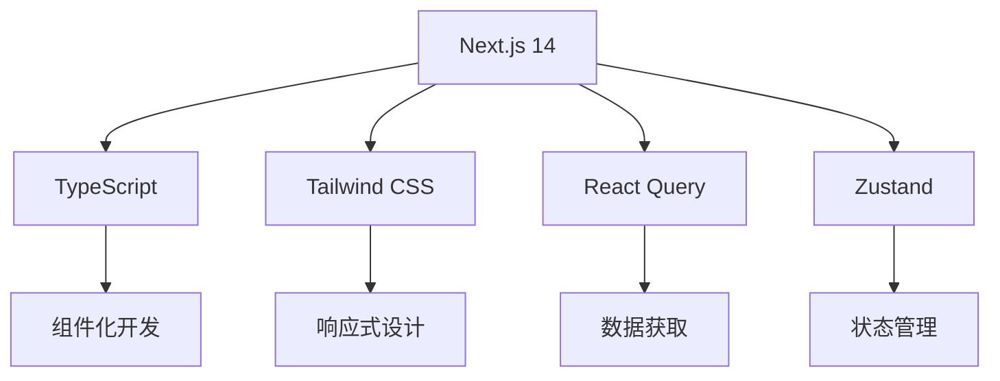
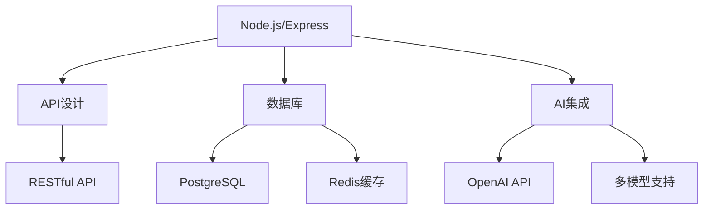
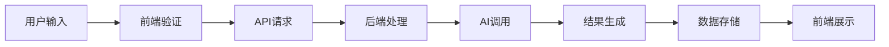
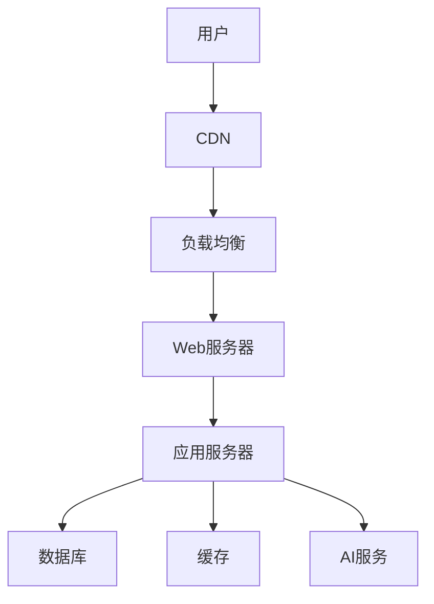

# localhost:2014 BibiGPT 完善方案

## 1. 项目概述

基于对 BibiGPT (bibigpt.co) 和 localhost:2014 的深入对比分析，本方案旨在将 localhost:2014 打造成功能完善、体验优秀的音视频内容 AI 总结平台。

### 1.1 对比分析总结

| 功能特性     | BibiGPT (bibigpt.co)                     | localhost:2014       |
| ------------ | ---------------------------------------- | -------------------- |
| **平台支持** | B 站、YouTube、播客、TED、小红书、抖音等 | 仅支持 B 站、YouTube |
| **AI 模型**  | GPT/Gemini/Claude 多模型选择             | 仅 GPT-3.5           |
| **总结类型** | 摘要、章节大纲、思维导图、AI 对话        | 摘要、亮点、思考     |
| **输出格式** | 多种格式导出、笔记集成                   | 复制、下载           |
| **批量处理** | 支持批量总结                             | 不支持               |
| **订阅功能** | 支持 RSS 订阅                            | 不支持               |
| **多语言**   | 中英日韩等多语言                         | 12 种语言选择        |
| **用户系统** | 完整会员体系                             | 无用户系统           |
| **客户端**   | 桌面端、移动端、浏览器插件               | 仅 Web 版            |

| 设计元素       | BibiGPT (bibigpt.co) | localhost:2014 |
| -------------- | -------------------- | -------------- |
| **整体风格**   | 现代化、简洁、专业   | 简约、功能导向 |
| **导航结构**   | 侧边栏+顶部导航      | 顶部导航       |
| **响应式设计** | 完全响应式           | 基础响应式     |
| **交互体验**   | 流畅、直观           | 基础、可用     |
| **视觉层次**   | 清晰、有层次         | 简单、直接     |

## 2. 功能增强计划

### 2.1 平台扩展

#### 2.1.1 新增平台支持

- **小红书**：支持小红书视频内容总结
- **YouTube**:支持 YouTube 视频总结
- **抖音**：支持抖音短视频内容总结
- **播客平台**：支持喜马拉雅、小宇宙等播客内容
- **TED 演讲**：支持 TED 演讲视频总结
- **本地文件处理**：支持本地音视频文件上传和处理（mp4、mov、mpg、mp3、m4a、wav 等）

#### 2.1.2 批量处理功能

- **批量链接输入**：支持多个视频链接同时输入和处理
- **批量结果管理**：提供批量结果的统一管理和导出
- **批量模板应用**：支持批量应用相同的总结模板

### 2.2 AI 功能升级

#### 2.2.1 多模型支持

- **GPT-4**：集成最新的 GPT-4 模型，提供更准确的总结
- **Claude**：集成 Claude 模型，增强长文本处理能力
- **Gemini**：集成 Google Gemini 模型，提供多模态处理能力
- **模型选择器**：用户可根据需求选择合适的 AI 模型

#### 2.2.2 智能对话功能

- **视频内容对话**：基于视频内容进行 AI 对话
- **深度问答**：支持对视频内容的深度问答
- **对话历史**：保存对话历史，支持回溯和参考

#### 2.2.3 个性化总结

- **用户偏好设置**：记录用户总结偏好
- **智能推荐**：根据用户历史推荐合适的总结方式
- **自定义模板**：支持用户自定义总结模板

### 2.3 输出格式优化

#### 2.3.1 多格式导出

- **PDF 导出**：支持 PDF 格式导出，保留格式和样式
- **Word 导出**：支持 Word 格式导出，便于编辑
- **Markdown 导出**：支持 Markdown 格式，适合技术用户
- **思维导图**：生成可交互的思维导图文件

#### 2.3.2 笔记集成

- **Notion 集成**：支持一键同步到 Notion
- **Obsidian 集成**：支持同步到 Obsidian 知识库
- **Readwise 集成**：支持同步到 Readwise
- **Email 导出**：支持通过 Email 发送总结结果

#### 2.3.3 一键分享

- **社交媒体分享**：支持微信、微博、小红书 等分享
- **链接分享**：生成分享链接，便于他人访问
- **二维码分享**：生成二维码，支持移动端分享（未做）

## 3. UI/UX 改进计划

### 3.1 界面现代化

#### 3.1.1 设计升级

- **现代化设计语言**：采用最新的设计趋势，提升视觉体验
- **品牌化设计**：建立统一的视觉识别系统
- **动画效果**：添加适当的动画效果，提升交互体验

#### 3.1.2 响应式优化

- **移动端适配**：完善移动端界面设计和交互
- **平板适配**：优化平板设备的显示效果
- **跨设备同步**：支持多设备间的数据同步

#### 3.1.3 交互优化

- **操作流程简化**：简化用户操作步骤
- **智能提示**：提供智能化的操作提示和帮助
- **快捷键支持**：支持常用操作的快捷键

### 3.2 功能模块化

#### 3.2.1 侧边栏导航

- **功能分类**：将功能按类别组织在侧边栏
- **快速访问**：提供常用功能的快速访问入口
- **状态显示**：显示各功能模块的状态信息

#### 3.2.2 主工作区优化

- **多标签页**：支持多个任务同时进行
- **拖拽排序**：支持拖拽调整内容顺序
- **全屏模式**：支持全屏工作模式

#### 3.2.3 状态管理

- **实时状态**：实时显示处理进度和状态
- **错误提示**：友好的错误提示和解决方案
- **操作历史**：记录用户操作历史，支持撤销和重做

#### 3.3 问答板块

- **搜寻解答**：可以根据字幕内容与使用者进行问答对话

## 4. 技术架构优化

### 4.1 后端架构

#### 4.1.1 API 重构

- **RESTful API 设计**：设计规范的 RESTful API 接口
- **GraphQL 支持**：支持 GraphQL 查询，提升数据获取效率
- **API 版本管理**：实现 API 版本管理，确保向后兼容

#### 4.1.2 数据库设计

- **用户数据管理**：设计用户信息、偏好设置等数据存储
- **历史记录管理**：实现用户历史记录的存储和查询
- **数据备份**：实现数据备份和恢复机制

#### 4.1.3 缓存优化

- **Redis 缓存**：使用 Redis 缓存热点数据
- **CDN 加速**：使用 CDN 加速静态资源加载
- **数据库优化**：优化数据库查询和索引

### 4.2 前端架构

#### 4.2.1 组件化开发

- **组件库建设**：建立可复用的 UI 组件库
- **组件文档**：编写详细的组件使用文档
- **组件测试**：为组件编写单元测试和集成测试

#### 4.2.2 状态管理

- **Zustand 集成**：使用 Zustand 进行状态管理
- **React Query**：使用 React Query 处理服务端状态
- **本地状态**：优化本地状态管理逻辑

#### 4.2.3 错误处理

- **全局错误处理**：实现全局错误捕获和处理
- **错误边界**：使用 React Error Boundary 处理组件错误
- **错误上报**：实现错误日志收集和上报

## 5. 商业化方案

### 5.1 会员体系

#### 5.1.1 免费版

- **基础功能**：提供核心的音视频总结功能
- **使用限制**：每日免费使用次数限制
- **平台限制**：支持主要平台，但有次数限制

#### 5.1.2 专业版

- **高级功能**：解锁所有高级功能
- **无限使用**：无使用次数限制
- **优先支持**：提供优先技术支持

#### 5.1.3 企业版

- **定制功能**：根据企业需求定制功能
- **专属服务**：提供专属客户经理和技术支持
- **私有部署**：支持私有化部署方案

### 5.2 盈利模式

#### 5.2.1 订阅制

- **月度订阅**：按月付费，灵活取消
- **年度订阅**：按年付费，享受折扣
- **家庭订阅**：支持多用户使用

#### 5.2.2 按量付费

- **次数包**：购买使用次数包
- **时长包**：购买使用时长包
- **功能包**：按功能模块单独购买

#### 5.2.3 企业定制

- **定制开发**：根据企业需求定制开发
- **培训服务**：提供员工培训服务
- **技术支持**：提供专业技术支持

## 6. 实施路线图

### 6.1 第一阶段（1-2 个月）

#### 6.1.1 UI 界面现代化改造

- [ ] 设计系统升级
- [ ] 响应式布局优化
- [ ] 交互体验改进
- [ ] 移动端适配

#### 6.1.2 核心功能优化

- [ ] 性能优化
- [ ] Bug 修复
- [ ] 错误处理完善
- [ ] 用户体验提升

#### 6.1.3 基础会员系统

- [ ] 用户注册登录
- [ ] 会员权限管理
- [ ] 支付系统集成
- [ ] 使用统计功能

### 6.2 第二阶段（3-4 个月）

#### 6.2.1 多平台支持扩展

- [ ] 小红书平台集成
- [ ] 抖音平台集成
- [ ] 播客平台集成
- [ ] 本地文件处理

#### 6.2.2 AI 功能升级

- [ ] GPT-4 模型集成
- [ ] Claude 模型集成
- [ ] Gemini 模型集成
- [ ] 智能对话功能

#### 6.2.3 输出格式优化

- [ ] PDF 导出功能
- [ ] Word 导出功能
- [ ] Markdown 导出功能
- [ ] 思维导图生成

### 6.3 第三阶段（5-6 个月）

#### 6.3.1 移动端应用开发

- [ ] iOS 应用开发
- [ ] Android 应用开发
- [ ] 跨平台方案评估
- [ ] 应用上架发布

#### 6.3.2 企业级功能开发

- [ ] 企业管理后台
- [ ] 团队协作功能
- [ ] 数据安全增强
- [ ] 私有化部署方案

#### 6.3.3 商业化运营启动

- [ ] 市场推广策略
- [ ] 用户增长计划
- [ ] 客户服务体系
- [ ] 数据分析体系

## 7. 技术实现要点

### 7.1 前端技术栈

### 7.2 后端技术栈

### 7.3 数据流设计

### 7.4 部署架构

## 8. 关键优化建议

### 8.1 用户体验优先

- **简化操作流程**：减少用户操作步骤，提升使用便捷性
- **智能提示**：提供智能化的操作提示和帮助
- **个性化体验**：根据用户偏好提供个性化服务

### 8.2 性能优化

- **加载速度**：优化页面加载速度，提升用户体验
- **响应时间**：减少 API 响应时间，提升操作流畅度
- **资源优化**：优化图片、脚本等资源大小和加载方式

### 8.3 安全加固

- **数据安全**：加强用户数据保护，确保数据安全
- **隐私保护**：严格遵守隐私保护法规，保护用户隐私
- **访问控制**：实现完善的访问控制和权限管理

### 8.4 可扩展性

- **模块化设计**：采用模块化设计，便于功能扩展
- **微服务架构**：考虑向微服务架构演进，提升系统可扩展性
- **云原生**：采用云原生技术，提升系统弹性和可扩展性

### 8.5 移动优先

- **响应式设计**：优先考虑移动端体验，实现真正的跨平台支持
- **触摸优化**：优化触摸交互，提升移动端操作体验
- **离线功能**：支持离线使用，提升移动端实用性

## 9. 风险评估与应对

### 9.1 技术风险

- **AI 模型依赖**：过度依赖第三方 AI 服务，存在服务稳定性风险
- **性能瓶颈**：用户量增长可能导致性能瓶颈
- **技术债务**：快速迭代可能积累技术债务

### 9.2 市场风险

- **竞争加剧**：市场竞争激烈，需要持续创新
- **用户获取成本**：用户获取成本可能持续上升
- **技术变化**：AI 技术快速发展，需要持续跟进

### 9.3 应对策略

- **技术储备**：保持技术储备，降低对外部依赖
- **性能监控**：建立完善的性能监控体系
- **用户反馈**：建立用户反馈机制，快速响应用户需求
- **创新机制**：建立创新机制，保持产品竞争力

## 10. 成功指标

### 10.1 技术指标

- **页面加载时间**：页面加载时间控制在 2 秒以内
- **API 响应时间**：API 响应时间控制在 500 毫秒以内
- **系统稳定性**：系统可用性达到 99.9%以上

### 10.2 业务指标

- **用户增长**：月活跃用户数达到 10 万+
- **付费转化**：付费用户转化率达到 5%+
- **用户留存**：月留存率达到 30%+

### 10.3 用户体验指标

- **用户满意度**：用户满意度达到 4.5 分以上（5 分制）
- **功能使用率**：核心功能使用率达到 80%+
- **用户反馈响应**：用户反馈响应时间控制在 24 小时内

通过以上完善方案的实施，localhost:2014 将逐步发展成为功能完善、体验优秀的音视频内容 AI 总结平台，在市场中占据有利位置。
